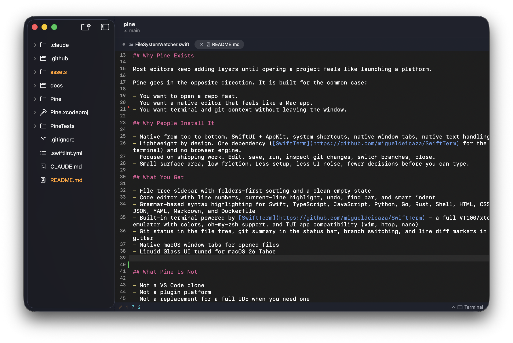
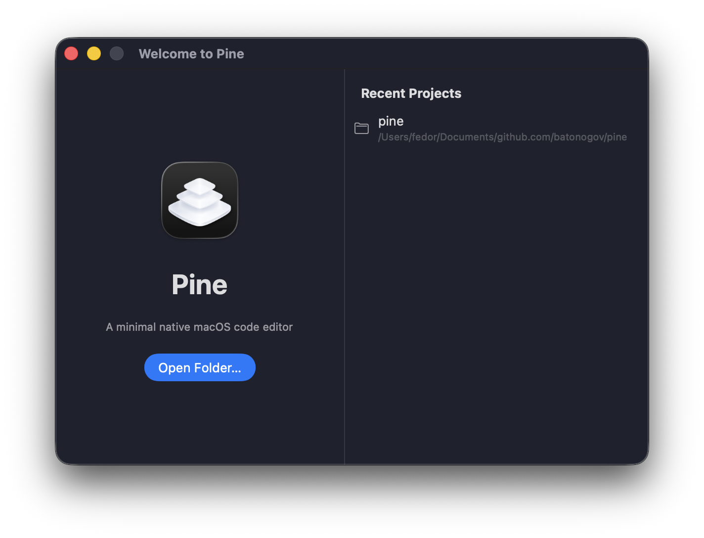
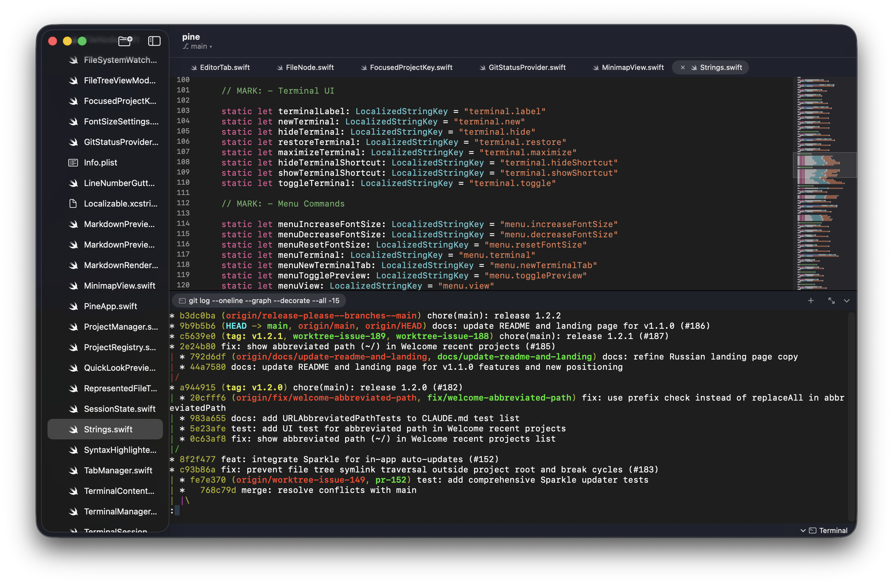
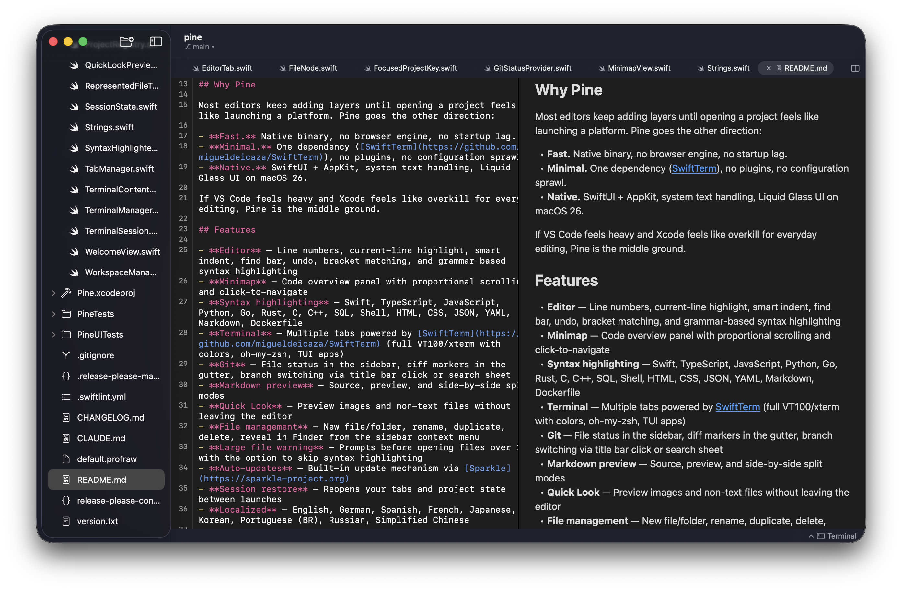

# Pine

[](https://github.com/batonogov/pine/actions/workflows/ci.yml)
[](https://github.com/batonogov/pine/releases/latest)
[](https://formulae.brew.sh/cask/pine-editor)
[](https://github.com/batonogov/pine/blob/main/LICENSE)
[](https://github.com/batonogov/pine)

> A minimal native code editor for macOS.

<p align="center">
  
</p>

Pine is a code editor for developers who want a fast, native Mac app without the overhead of Electron. Built with SwiftUI and AppKit, designed for macOS 26 Liquid Glass. Opens instantly, stays out of your way.

## Features

- **Native macOS** — SwiftUI + AppKit, Liquid Glass UI, system text handling. No browser engine, no runtime
- **Syntax highlighting** — 37 languages including Swift, TypeScript, Python, Go, Rust, Java, Kotlin, Ruby, C/C++, and more
- **Built-in terminal** — Full VT100/xterm emulator via [SwiftTerm](https://github.com/migueldeicaza/SwiftTerm). Multiple tabs, colors, TUI apps, oh-my-zsh
- **Git integration** — File status in sidebar, diff markers in gutter, blame view, branch switching from title bar or search sheet
- **Symbol navigation** — Jump to functions and classes with Cmd+R
- **Code folding** — Fold/unfold blocks from the gutter or via menu
- **Minimap** — Scaled code overview with syntax colors and diff markers. Click to navigate
- **Find & replace** — In-file and project-wide search with .gitignore support
- **Quick Open** — Fuzzy file search with Cmd+P
- **Markdown preview** — Source, rendered, or side-by-side via [swift-markdown](https://github.com/swiftlang/swift-markdown)
- **Status bar** — Cursor position, line endings, indentation style, file size
- **Bracket matching** — Highlights matching pairs while skipping strings and comments
- **File management** — Reveal in Finder, duplicate files with Finder-like naming
- **Large file handling** — Progressive loading for 10 MB+ files, optional highlighting disable for 1 MB+
- **Strip trailing whitespace** — Automatically cleans up on save
- **Auto-save & session restore** — Picks up where you left off
- **Auto-updates** — Built-in via [Sparkle](https://sparkle-project.org)
- **Localized** — English, German, Spanish, French, Japanese, Korean, Portuguese (BR), Russian, Simplified Chinese

<details>
<summary>Screenshots</summary>

### Welcome Screen


### Built-in Terminal


### Markdown Preview


</details>

## Install

**Homebrew** (recommended):

```bash
brew tap batonogov/tap
brew install --cask pine-editor
```

**Direct download:** grab the latest `.dmg` from [Releases](https://github.com/batonogov/pine/releases/latest).

## Build from Source

Requires macOS 26+ and Xcode 26+.

```bash
git clone https://github.com/batonogov/pine.git
cd pine
sudo xcode-select -s /Applications/Xcode.app/Contents/Developer
xcodebuild -project Pine.xcodeproj -scheme Pine build
```

Dependencies resolve automatically via Swift Package Manager on first build.

## Keyboard Shortcuts

| Shortcut | Action |
| --- | --- |
| `Cmd+P` | Quick Open |
| `Cmd+Shift+O` | Open folder |
| `Cmd+S` | Save |
| `Cmd+Option+S` | Save All |
| `Cmd+Shift+S` | Save As |
| `Cmd+Shift+D` | Duplicate file |
| `Cmd+W` | Close tab |
| `Cmd+F` | Find |
| `Cmd+Option+F` | Find & Replace |
| `Cmd+G` / `Cmd+Shift+G` | Find Next / Previous |
| `Cmd+E` | Use Selection for Find |
| `Cmd+L` | Go to Line |
| `Cmd+R` | Go to Symbol |
| `Cmd+/` | Toggle comment |
| `Cmd+Shift+B` | Switch branch |
| `Cmd+Shift+M` | Toggle minimap |
| `Cmd+Shift+P` | Markdown preview |
| `Ctrl+Option+Down` / `Up` | Next / Previous change |
| `` Cmd+` `` | Toggle terminal |
| `Cmd+T` | New terminal tab |
| `Cmd++` / `Cmd+-` | Zoom in / out |
| `Cmd+0` | Reset font size |

## Architecture

MVVM with SwiftUI views backed by AppKit via `NSViewRepresentable`. The editor core uses the native NSTextStorage/NSLayoutManager/NSTextContainer stack. Syntax highlighting runs asynchronously on a background queue with generation tokens to prevent stale results. Git operations run in parallel via GCD. Project-wide search uses Swift concurrency with sliding-window parallelism.

See [CLAUDE.md](CLAUDE.md) for the full technical reference.

## Contributing

Contributions are welcome. Please open an issue first to discuss what you'd like to change. See the [Issues](https://github.com/batonogov/pine/issues) page.

## License

[MIT](LICENSE)
