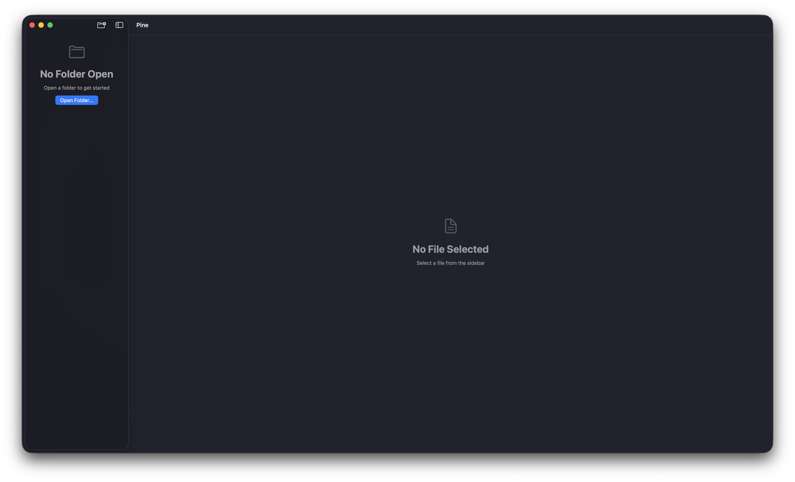

# Pine

> A native Mac code editor for developers who are tired of opening a browser just to edit code.



Pine is a focused code editor for macOS 26+ built with SwiftUI and AppKit. It gives you the core developer loop in one clean native app: open a folder, edit code, run commands, check git, move on.

No Electron. No extension marketplace. No settings archaeology. No pretending to be an operating system inside your operating system.

If VS Code feels heavy and Xcode feels like overkill for day-to-day editing, Pine is the middle ground.

## Why Pine Exists

Most editors keep adding layers until opening a project feels like launching a platform.

Pine goes in the opposite direction. It is built for the common case:

- You want to open a repo fast.
- You want a native editor that feels like a Mac app.
- You want terminal and git context without leaving the window.
- You do not want plugins, tabs, panels, and settings fighting for attention.

## Why People Install It

- Native from top to bottom. SwiftUI + AppKit, system shortcuts, native window tabs, native text handling.
- Lightweight by design. Zero third-party dependencies and no browser engine.
- Focused on shipping work. Edit, save, run, inspect git changes, switch branches, close.
- Small surface area, low friction. Less setup, less UI noise, fewer decisions before you can type.

## What You Get

- File tree sidebar with folders-first sorting and a clean empty state
- Code editor with line numbers, current-line highlight, undo, find bar, and smart indent
- Grammar-based syntax highlighting for Swift, TypeScript, JavaScript, Python, Go, Rust, Shell, HTML, CSS, JSON, YAML, Markdown, and Dockerfile
- Built-in terminal powered by a real PTY, with support for multiple terminal tabs
- Git status in the file tree, git summary in the status bar, branch switching, and line diff markers in the gutter
- Native macOS window tabs for opened files
- Liquid Glass UI tuned for macOS 26 Tahoe

## What Pine Is Not

- Not a VS Code clone
- Not a plugin platform
- Not a replacement for a full IDE when you need one
- Not another Electron shell

## Install In 10 Seconds

```bash
brew tap batonogov/pine-editor
brew install --cask pine-editor
```

Or download the latest `.dmg` from [Releases](https://github.com/batonogov/pine/releases).

## Keyboard Shortcuts

| Shortcut | Action |
| --- | --- |
| `Cmd+Shift+O` | Open folder |
| `Cmd+S` | Save file |
| `Cmd+\`` | Toggle terminal |
| `Cmd+Shift+B` | Switch git branch |
| `Cmd+W` | Close current tab |

## Build From Source

Requires macOS 26+ and Xcode 26+.

```bash
git clone https://github.com/batonogov/pine.git
cd pine
xcodebuild -project Pine.xcodeproj -scheme Pine build
```

## Built With

- SwiftUI for app structure and native macOS UI
- AppKit text system for the editor core
- JSON grammars for syntax highlighting
- `openpty()`-based terminal integration
- Zero third-party dependencies

## License

MIT
