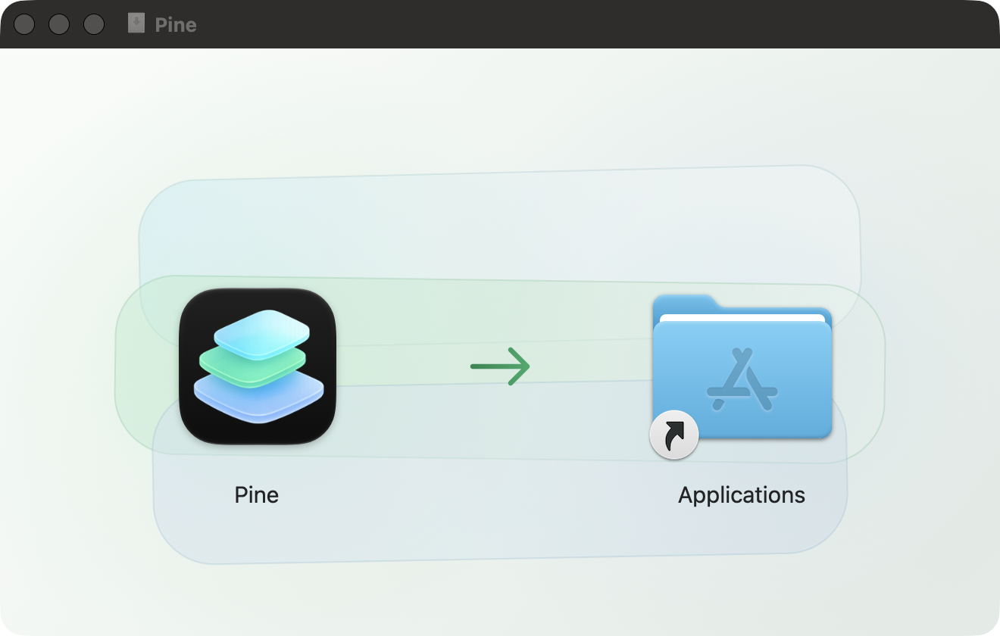

# DMG packaging

Pine ships in a branded drag-to-Applications disk image built entirely with
macOS system tools. The editable artwork, rendered Retina asset, and Finder
layout are source-controlled in `assets/dmg/`.

The Finder uses dark item labels whenever an icon view has a custom background
picture; it does not expose a supported label-color setting. Keep the area under
`Pine` and `Applications` light enough for those system labels rather than
drawing replacement labels into the artwork.



## Build and preview locally

Build an unsigned Release app for visual work:

```bash
export DEVELOPER_DIR=/Applications/Xcode.app/Contents/Developer
xcodebuild build \
  -project Pine.xcodeproj \
  -scheme Pine \
  -configuration Release \
  -destination 'platform=macOS' \
  -derivedDataPath /tmp/pine-dmg-derived \
  CODE_SIGN_IDENTITY=- \
  CODE_SIGNING_ALLOWED=NO
```

Render the editable SVG at 2x and build the image:

```bash
xcrun swift scripts/render-dmg-background.swift \
  assets/dmg/background.svg \
  assets/dmg/background@2x.png

bash scripts/create-dmg.sh --overwrite \
  /tmp/pine-dmg-derived/Build/Products/Release/Pine.app \
  /tmp/Pine-local.dmg

open /tmp/Pine-local.dmg
```

The renderer rejects source dimensions other than 1320x840 pixels and writes a
660x420-point, 144-DPI PNG. `create-dmg.sh` rejects an existing destination
unless `--overwrite` is explicit.

For an unsigned local app, verify the final layout and bundle metadata while
explicitly skipping release-only security checks:

```bash
VERSION=$(/usr/libexec/PlistBuddy \
  -c 'Print :CFBundleShortVersionString' \
  /tmp/pine-dmg-derived/Build/Products/Release/Pine.app/Contents/Info.plist)

bash scripts/verify-dmg.sh --skip-security \
  /tmp/Pine-local.dmg \
  "$VERSION"
```

Omit `--skip-security` for a Developer ID build. The verifier then extracts the
packaged app and fails unless all three checks pass:

```bash
codesign --verify --deep --strict Pine.app
xcrun stapler validate Pine.app
spctl --assess --type execute Pine.app
```

## macOS compatibility

macOS 26 uses the established `hdiutil` path. macOS 27 uses the replacement
`diskutil image` API because the corresponding `hdiutil` operations are
deprecated there. Exercise the macOS 26 packaging path on a newer development
machine with:

```bash
PINE_DMG_FORCE_LEGACY_HDIUTIL=1 \
  bash scripts/create-dmg.sh --overwrite \
  /path/to/Pine.app \
  /tmp/Pine-legacy-path.dmg
```

Before release, mount the resulting image on macOS 26 and the current macOS 27
beta and check:

- the window opens at 660x420 points without toolbar, status bar, clipping, or
  scrollbars;
- only `Pine.app` and `Applications` are visible;
- both 128-point icons and their system labels are aligned and readable;
- the arrow clearly communicates drag-to-install;
- dragging Pine onto Applications installs an app that launches;
- the layout remains sharp on a Retina display and readable with both light and
  dark Finder chrome.

Record the complete environment in the PR or release evidence:

```bash
sw_vers
xcodebuild -version
xcrun --sdk macosx --show-sdk-version
xcrun --sdk macosx --show-sdk-build-version
```

## Release workflow

`.github/workflows/release.yml` staples the notarized app before invoking the
packager. It then runs `verify-dmg.sh` without the local security opt-out before
Sparkle signs the same versioned `Pine-{version}.dmg`. GitHub Release upload,
appcast generation, and the Homebrew checksum therefore continue consuming one
unchanged artifact.

Portable regression coverage lives in
`scripts/tests/test-dmg-packaging.sh`. The test fakes only macOS system commands
and covers both packaging APIs, image contents, version mismatch, Retina asset
dimensions, unexpected visible files, and release security command invocation.
